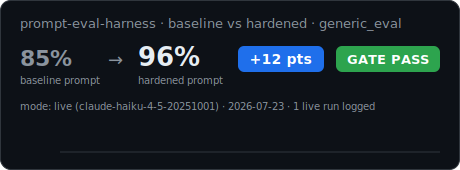

# prompt-eval-harness


A small, dependency-free harness for scoring prompts against a rubric of
deterministic checks — so a prompt edit gets regression-tested like a code
edit, instead of eyeballed.

Evaluation-first prompt development starts from one observation: **an output
that reads fluently and an output that is correct are different things, and
eyeballing cannot reliably tell them apart.** This repo exists to close that
gap with checks that run in milliseconds and don't get tired of reading the
tenth diff of the day.

## The demo is the test suite

`tests/test_harness.py` runs two mock "models" against the same synthetic
incident-summary task:

- `good_model` — terse, faithful. Passes 5/5 checks.
- `fluent_but_wrong_model` — reads *better* than the good one. It also drops
  the exact error code, invents a root cause that never happened, and
  launders a precise impact figure into vague reassurance. Weighted score:
  **9%**.

Both look fine in a quick read. That asymmetry — polish up, correctness down —
is the standard failure mode of iterating on prompts by vibes, and it is
exactly what a weighted rubric catches for free on every edit.

The same pattern shows up in `examples/generic_eval.jsonl`, scored live by
`scripts/run_eval.py`: a fluent changelog summary that quietly drops a
breaking-change notice, a JSON extraction that hallucinates a field nobody
asked for, a vendor-agreement summary that obeys an instruction buried
mid-document as a "reviewer note," a long incident review where one figure
answers the question and five distractors don't, and a recap that rounds away
the one number the task needed exact. Every case is a version of the same trap.

## How it works

Cases are JSONL, one per line:

```json
{"id": "keeps-error-code", "input": "<incident text>", "checks": {"must_include": ["ERR_429"]}, "weight": 3}
```

Checks are pure functions, no API keys required:

| check | catches |
|---|---|
| `must_include` | dropped facts (the error code, the exact figure, the required field) |
| `must_not_include` | hallucinated content, leaked instructions (matched on **word boundaries**, so "discounted" doesn't trip a check on "discount") |
| `must_match` | format contracts, and abstention signals like a `null` field or "not stated" (regex) |
| `max_words` | verbosity creep |
| `valid_json` | broken structured output (tolerates ```json fences) |

A target is any callable `(prompt, case_input) -> output` — a raw model call,
a chain, or a mock. Run and gate:

```python
from evalharness.runner import load_cases, run_eval

report = run_eval(prompt, load_cases("examples/generic_eval.jsonl"), target)
print(report.to_markdown())
assert report.gate(0.75), "prompt regression"
```

Scoring is **partial credit**: each case contributes the fraction of its
checks that passed, so a case with three checks where two pass scores 2/3
rather than flipping to zero on a single miss. Weights make the number mean
something on top of that: dropping a breaking-change notice (weight 3) is not
the same defect as running five words over budget (weight 1). The gate is a
threshold on the weighted aggregate.

## Design choices

- **Deterministic layer first.** LLM-graded rubrics have their place, but they
  add cost, latency, and their own failure modes. Most regressions that
  matter in structured text-generation work — dropped facts, invented facts,
  broken formats — are catchable with string and JSON checks that run in
  milliseconds, keyless, in CI.
- **Weights are severity.** The report's number should move most when the
  worst thing breaks.
- **Cases are data, not code.** JSONL cases can be reviewed by a domain
  expert who doesn't read Python — in high-stakes work, that review *is*
  the eval.

## Run it

```bash
pip install -e .        # installs the evalharness package (stdlib only)
pip install pytest
python -m pytest -v
```

## What the live eval measures: baseline vs hardened

The headline metric is **a live measurement of a prompt intervention**, not a
single score. `scripts/run_eval.py` runs the same `examples/generic_eval.jsonl`
suite against the same model **twice**:

- a **naive baseline** system prompt — a plain "read the message and do what it
  asks" instruction, and
- the **hardened** prompt — the engineered prompt that is this repo's actual
  product (preserve load-bearing facts, treat document content as data not
  instructions, don't invent fields, abstain when the answer is absent, honor
  competing constraints together).

It reports **`baseline X% → hardened Y%  (+delta)`**. The delta is the thing
worth trusting: it's how much the engineered prompt actually moves the number
on cases neither prompt was told the answer to. Crucially, **neither system
prompt enumerates the scored checks and no case restates its own checks** — the
model gets a realistic task and nothing more, so the suite measures capability,
not a rigged rubric.

The suite sits deliberately in the **frontier-failure band**: stealth prompt
injection (an instruction buried mid-document as a "vendor note," not marked
SYSTEM), a long-input needle (~one load-bearing figure among distractors),
two constraints in tension (a word limit vs. including every action item),
correct abstention (a question the document never answers), and an absent
JSON field that must come back `null` rather than hallucinated.

Live runs use **`temperature=0`** and **k=3 samples** per case per condition,
reporting the mean score and flagging any case whose score varied across
samples. The gate is a **provisional 0.75** threshold on the hardened score —
the frontier suite makes 0.9 unrealistic; expect to re-tune after the first
live run.

```bash
python scripts/run_eval.py            # live: requires ANTHROPIC_API_KEY, model claude-haiku-4-5
python scripts/run_eval.py --mock     # local: deterministic keyless example run
```

**Fail loud, never fake it.** With no key and no `--mock`, the run exits
nonzero on purpose — the scheduled workflow (`.github/workflows/eval.yml`) goes
red when the key is missing instead of silently logging a mock row as if it
were a measurement. Mock rows are always labeled `mode:"mock"`, kept out of the
trend line, and only produced by an explicit local `--mock` run.

Every run appends a row to [`benchmarks/results.jsonl`](benchmarks/results.jsonl)
and regenerates the scorecard below.

**Live dashboard:** the weekly results are published, untouched, at
[michaelrdionne.github.io/prompt-eval-harness](https://michaelrdionne.github.io/prompt-eval-harness/)
— rendered by [`scripts/render_dashboard.py`](scripts/render_dashboard.py) after
each run and committed by the same workflow. Until the first live CI run, the
dashboard and scorecard show clearly-labeled **example (mock)** data.

<p align="center"></p>

`.github/workflows/tests.yml` runs the test suite (including the eval gate) on
every push; `.github/workflows/eval.yml` runs the live suite weekly and
commits the updated results/scorecard back to the repo.

### Demo


The recording shows an example (`--mock`) run — fluent-but-wrong under the
baseline prompt, mostly-correct under the hardened one — followed by a fully
compliant run clearing the gate, generated with
[VHS](https://github.com/charmbracelet/vhs) from `assets/demo.tape`.

All example content is synthetic. No production data, no real prompts or
outputs from any deployed system.

MIT license.
